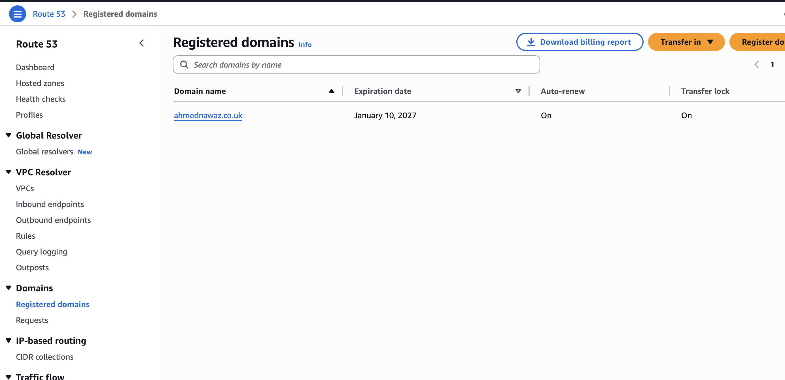
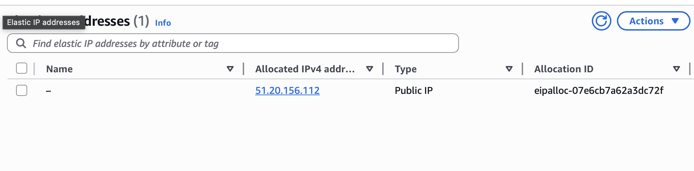
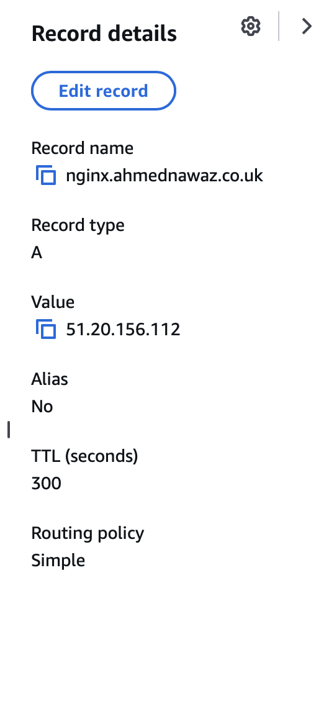
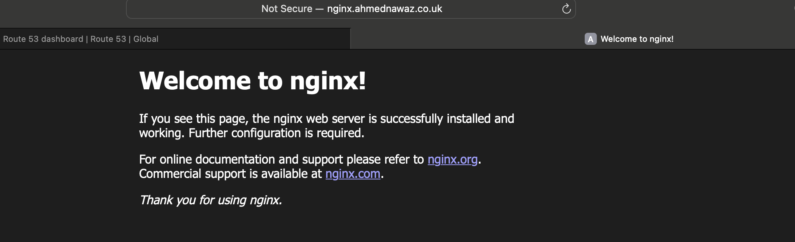
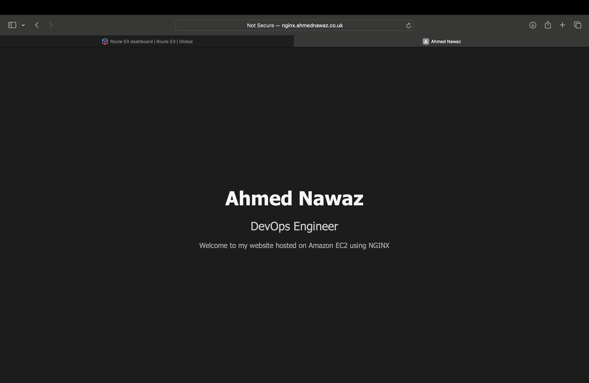

# NGINX Website on AWS EC2: nginx.ahmednawaz.co.uk

This project documents setting up a static website on an AWS EC2 instance running NGINX.  
The website is accessible via a custom domain configured using Amazon Route 53.


## Prerequisites

- AWS account (free tier used to avoid EC2 charges)
- Custom domain purchased via Amazon Route 53


## Project Overview

This project demonstrates practical networking and cloud concepts, including:

- DNS resolution
- IP addressing
- Security group (firewall) configuration
- HTTP web serving
- Customising NGINX landing page

## Steps

1. Purchased a custom domain using Route 53  

- On AWS, navigate to Route 53 and register a domain name:




2. Launched an EC2 instance running Amazon Linux  

- In AWS console: Search EC2 > Instances > Launch Instances
- I chose AMI: Amazon Linux 2
- Instance Type: t3.micro
- Enable auto Public ip
- Security Group: Allow HTTP (Port 80) and SSH (Port 22, Your IP address)
- Download key pair

3. Assign an Elastic IP: 

- Navigate to EC2- Network and security
- Elastic IP's
- Allocate Elastic IP address
- Link that Elastic IP to your instance

  


4. Installed and configured NGINX   

NGINX was installed on the Amazon Linux EC2 instance using the following commands:

```bash
ssh -i "my-key.pem" ec2-user@<elastic-ip>
sudo yum install -y nginx
sudo systemctl start nginx
sudo systemctl enable nginx
```

5. Created Route 53 A records pointing the domain to the EC2 instance

- Route 53- Hosted Zones
- Create A record and link it to your Elastic IP address

  

  
6. Verified the website was accessible via the NGINX landing page



7. Customised NGINX landing page  




## Result

The NGINX default page was replaced with a custom landing page, successfully served over HTTP via the domain

nginx.ahmednawaz.co.uk
